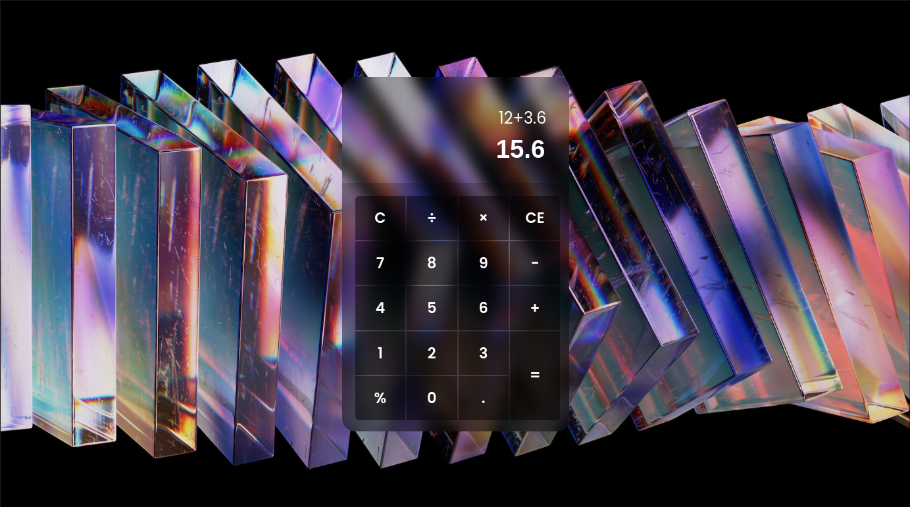

# Calculator Project

This project is part of The Odin Project's front-end curriculum. The goal is to create a basic HTML calculator with functionality for addition, subtraction, multiplication, and division operations.

## Preview

## Overview

The calculator project involves creating functions for basic math operations, implementing a user interface with digit buttons, operator buttons, an "Equals" key, and a display. Additionally, features like a "Clear" button and handling edge cases (division by zero) are implemented.

## Use Cases

The calculator should have the following abilities:

1. Addition (`add`)
2. Subtraction (`subtract`)
3. Multiplication (`multiply`)
4. Division (`divide`)
5. Ability to string together multiple operations (e.g., 12 + 7 - 5 * 3 = 42)
6. Round answers with long decimals to prevent overflow
7. Prevent issues caused by pressing "=" before entering all numbers or an operator
8. Display a snarky error message if the user tries to divide by 0
   
[Demo][https://facu18xk.github.io/calculator/]
